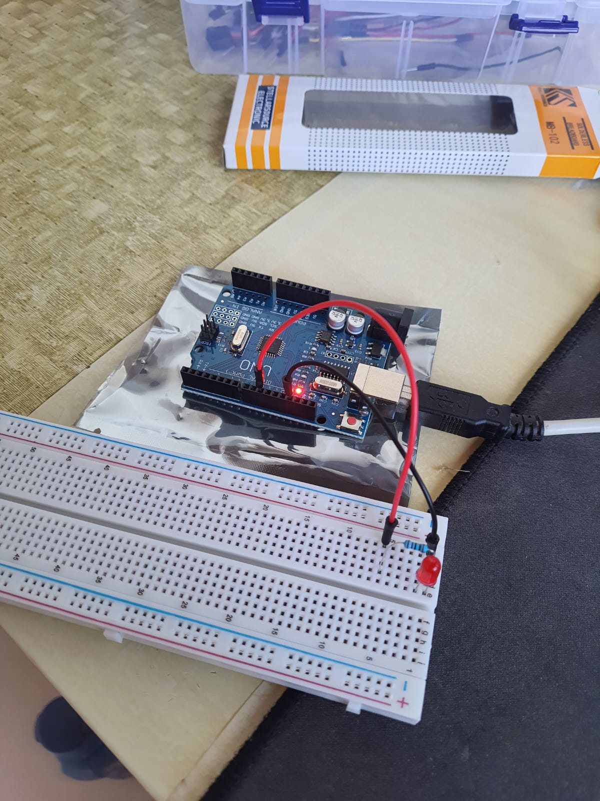

## Ingredients

> TENSTAR ROBOT - RFID KIT

- 220 Ohms Resistor
- LED
- 2 jumper wires
- Protoboard (Solderless)

### Method

- Red wire on Resistor's left that connects LED's positive side
- LED's negative (ground) side connected in the black jumper
- RED jumper connected in Arduino's 10th pin and the black on the GND pin

